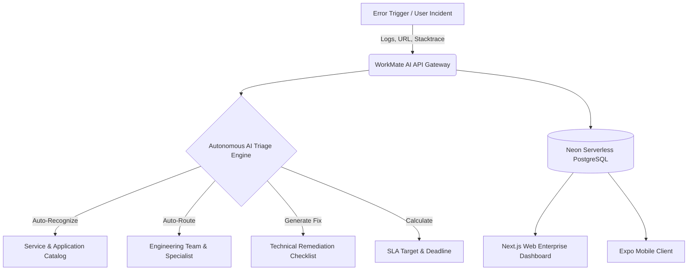
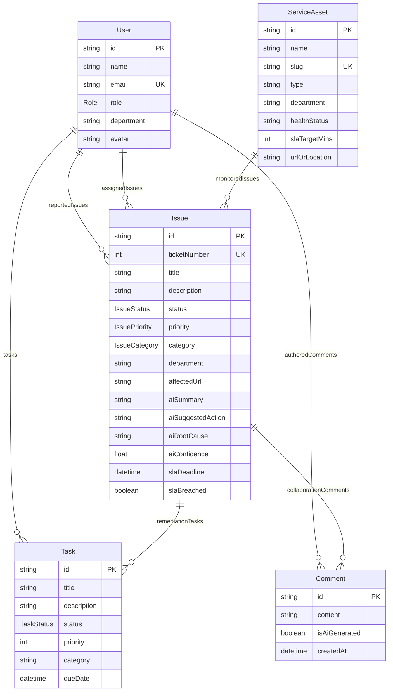

# WorkMate AI — User Manual & End-to-End System Guide
*Enterprise Software Engineering Incident Management & Autonomous AI Triage Platform*

---

## 1. Executive Summary & System Vision

**WorkMate AI** is a next-generation enterprise incident management and operational intelligence platform tailored specifically for **Software Engineering, Cloud Infrastructure, and SRE (Site Reliability Engineering) teams**.

Modern software companies operate hundreds of microservices, web portals, mobile apps, and distributed databases. When an outage or regression occurs, traditional ticketing tools require slow manual triage, routing, and diagnosis. WorkMate AI solves this by introducing **autonomous AI triage**:
- **Automatic Service Recognition**: Analyzes incident titles, stacktraces, and error URLs to immediately match the incident to its registered microservice (e.g. *Billing Gateway*, *Next.js Web Portal*, *Kubernetes Cluster*).
- **Intelligent Engineering Routing**: Determines the responsible engineering department (Backend, Frontend, DevOps, Database, or QA) and assigns the appropriate on-call engineer.
- **Root Cause & Remediation Generation**: Automatically synthesizes likely root causes and numbered step-by-step engineering remediation plans (circuit breakers, SSR dynamic imports, pod memory patching, B-Tree indexing).
- **Real-Time SLA & Shift Intelligence**: Continuously computes SLA deadlines, highlights SLA breaches, and generates automated executive shift briefings.



---

## 2. Monorepo Architecture & Directory Structure

WorkMate AI is structured as a high-performance **pnpm monorepo** consisting of three primary applications and shared configurations:

```text
WorkMate_AI/
├── apps/
│   ├── api/                  # Express + TypeScript + Prisma Backend
│   │   ├── prisma/
│   │   │   ├── schema.prisma # PostgreSQL Data Models & Enums
│   │   │   └── seed.ts       # Database Seeding Script (Software Team & Tickets)
│   │   └── src/
│   │       ├── app.ts        # Express App Configuration & Middleware
│   │       ├── server.ts     # HTTP Server Listener (Port 4000)
│   │       ├── routes/       # Express Route Controllers
│   │       └── services/     # Business Logic & AI Engines
│   │
│   ├── web/                  # Next.js 15 + React 19 Web Dashboard
│   │   └── src/app/
│   │       ├── globals.css   # Dark Glassmorphism Design Tokens & Styles
│   │       ├── layout.tsx    # Root HTML Layout & Typography
│   │       └── page.tsx      # Main Interactive Single-Page Dashboard
│   │
│   └── mobile/               # Expo React Native On-Call Mobile Client
│       └── src/
│           ├── app/index.tsx # Field & On-call Screen (Tasks & Issues)
│           └── lib/api.ts    # REST Client for API Integration
│
├── docs/                     # Guides, Architecture & API Documentation
└── package.json              # Monorepo Workspace Configuration
```

---

## 3. Database Schema & Data Models (`schema.prisma`)

The persistence layer runs on **Neon Serverless PostgreSQL** using **Prisma ORM**.

### Core Enums
- **`Role`**: `SUPER_ADMIN` (VP of Engineering), `ADMIN` (Ops Admin), `MANAGER` (Tech Lead), `ENGINEER` (Software Engineer), `USER` (QA / Reporter).
- **`IssueStatus`**: `OPEN`, `ASSIGNED`, `IN_PROGRESS`, `RESOLVED`, `CLOSED`.
- **`IssuePriority`**: `LOW`, `MEDIUM`, `HIGH`, `URGENT`.
- **`IssueCategory`**: `SOFTWARE`, `HARDWARE`, `NETWORK`, `FACILITY`, `SAFETY`, `OTHER`.
- **`TaskStatus`**: `TODO`, `IN_PROGRESS`, `DONE`.

### Entity Relationship Diagram



---

## 4. Backend Source Code & Flow (`apps/api`)

The backend is built with **Node.js, Express, and TypeScript**, enforcing strict type safety and modular separation of concerns.

### 1. `src/server.ts` & `src/app.ts`
- **`server.ts`**: The entry point. Imports `app` from `app.ts` and starts the HTTP listener on `PORT 4000`.
- **`app.ts`**: Configures global middleware:
  - `cors()` for cross-origin requests from the web dashboard (`localhost:3000`) and Expo mobile client.
  - `express.json()` for JSON body parsing.
  - Mounts all modular API sub-routers:
    - `/api/issues` ➔ `issue.routes.ts`
    - `/api/tasks` ➔ `task.routes.ts`
    - `/api/users` ➔ `user.routes.ts`
    - `/api/services` ➔ `service.routes.ts`
    - `/api/stats` ➔ `stats.routes.ts`
    - `/api/ai` ➔ `ai.routes.ts`

### 2. Services Layer (`src/services/`)
- **`ai.service.ts`**: The brain of WorkMate AI:
  - **`triageIssue()`**: Accepts incident details, performs heuristic keyword extraction or calls Google Gemini, recognizes the service asset, predicts priority and department, and generates technical remediation steps.
  - **`generateShiftSummary()`**: Computes an executive shift briefing, highlights active blockers, and calculates task completion velocity.
  - **`suggestNextAction()`**: Returns a 5-step engineering plan tailored to specific failure domains (Kubernetes OOM, React SSR hydration, PostgreSQL pool exhaustion, Payment Gateway 504 timeouts).
- **`issue.service.ts`**: Manages issue lifecycle, filtering, pagination, SLA deadline computation, and comments.
- **`task.service.ts`**: Handles CRUD for remediation tasks, issue linkage, and status toggles.
- **`stats.service.ts`**: Generates high-level metrics for dashboard gauges and department workload charts.

---

## 5. Web Dashboard Guide & Page Architecture (`apps/web`)

The web frontend is a **Next.js 15 (React 19)** single-page application located at [page.tsx](file:///d:/E/DRIVE/Project/MCA/WorkMate_AI_Full_Stack_Project_Guide/WorkMate_AI/apps/web/src/app/page.tsx).

### 1. Design System & Aesthetics
- **Theme**: Dark obsidian glassmorphism (`#0b0f19` background with frosted borders `rgba(255, 255, 255, 0.08)`).
- **Gradients**: Electric indigo (`#6366f1`) to cyan (`#06b6d4`) and AI purple (`#a855f7`).
- **Typography**: Inter / Outfit fonts with clear hierarchical badges for SLA, priority, and department.

### 2. Navigation & Tabs Breakdown

#### Tab 1: Operations Dashboard & Executive Shift Briefing
- **AI Executive Briefing**: Summarizes urgent production incidents, pending tasks, and completion velocity in real-time.
- **KPI Metrics Cards**:
  - Total Active Incidents & Urgent Alerts.
  - SLA Compliance Gauge & Breached Tickets Count.
  - Active Engineering Tasks & Velocity.
- **Department Workload Distribution**: Dynamic progress bars showing workload across:
  - *Backend & Core APIs*
  - *Frontend & Mobile Engineering*
  - *DevOps & Cloud SRE*
  - *Database & Platform Infrastructure*
  - *QA & Reliability Engineering*

#### Tab 2: Jira-Style Ticketing & Incident Kanban / Table View
- **Dual View Modes**: Switch between a visual **Kanban Board** (columns: *Open*, *Assigned*, *In Remediation*, *Resolved*, *Closed*) and a detailed **Table View**.
- **Multi-dimensional Filters**: Filter instantly by:
  - Free-text search (symptom, title, URL, or error code).
  - Engineering Department.
  - Status & Priority.
- **Ticket Cards**: Displays ticket number (`#19`), title, service badge, assignee avatar, SLA countdown pill, and AI confidence score.

#### Tab 3: Monitored Microservices & Application Catalog
- Displays all registered software assets:
  - *Customer Operations Web Portal* (`WEB_APP`)
  - *Billing & Payment Gateway API* (`API_SERVICE`)
  - *Auth & Identity Gateway* (`API_SERVICE`)
  - *Cloud Kubernetes Production Cluster* (`API_SERVICE`)
  - *Neon PostgreSQL Primary Cluster* (`API_SERVICE`)
- Tracks real-time health status: **OPERATIONAL**, **DEGRADED**, or **OUTAGE**, along with active incidents linked to each service.

#### Tab 4: Engineering Team & Specialist Directory
- Lists all active software team members, their roles (SuperAdmin, Manager, Software Engineer L4/L5, QA Lead), assigned open tickets, and active remediation tasks.

#### Tab 5: Remediation Task Board
- Displays checklist tasks linked to specific tickets. Engineers can mark tasks as `TODO`, `IN_PROGRESS`, or `DONE` directly with one click.

#### Tab 6: AI Autonomous Triage Hub & Diagnostic Sandbox
- An interactive testing playground where engineers can paste any error title, stacktrace, or affected URL and run neural triage on-demand to preview how WorkMate AI auto-routes the incident.

---

## 6. Step-by-Step User Manual

### Scenario A: How to Log an Incident with AI Autopilot
1. Click the **`+ Log Incident Ticket`** button in the top navigation bar.
2. In the modal, select the affected application from the **5 Predefined Projects**:
   - 🌐 **Customer Operations Web Portal** (Next.js Frontend · 30m SLA)
   - 💳 **Billing & Payment Gateway API** (Financial Service · 15m Urgent SLA)
   - 🔐 **Auth & Identity Gateway** (OAuth2/JWT · 15m Urgent SLA)
   - ☸️ **Cloud Kubernetes Production Cluster** (AWS EKS & SRE · 30m SLA)
   - 🐘 **Neon PostgreSQL Primary Cluster** (Database Infrastructure · 30m SLA)
   *(You can switch between **🎴 Visual Project Cards** or the **📋 Quick Dropdown**, or choose **🤖 AI Auto-Detect**)*
3. Entering a title or selecting a project will automatically pre-fill the responsible engineering squad and endpoint!
4. Set the **Priority** (Urgent, High, Medium, Low).
5. Paste the detailed error log, affected URL endpoint, or stacktrace into the description.
6. Ensure **`✨ WorkMate AI Auto-Pilot`** is checked.
7. Click **`Submit Incident`**.
8. **Result**: WorkMate AI automatically:
   - Matches the microservice and attributes it to the selected project.
   - Routes to the correct engineering department and specialist.
   - Calculates the exact SLA resolution deadline based on the project's SLA target.
   - Generates the root cause and a 3-step technical remediation checklist.

### Scenario B: Working on a Ticket & Collaborating
1. Click any ticket card on the **Kanban Board** or row in the **Table View**.
2. The **Ticket Detail Drawer** opens:
   - Review the **AI Diagnostic Summary**, **Root Cause**, and **Suggested Action Plan**.
   - Change the ticket status from `OPEN` to `IN_PROGRESS` or `RESOLVED`.
   - Reassign the specialist lead if necessary.
   - In the **Collaboration & Updates** thread, post engineering remediation notes or view AI Advisory alerts.

### Scenario C: Registering a New Microservice (SuperAdmin)
1. Switch the active user in the header to **Sarah Chen (SUPER_ADMIN)**.
2. Navigate to the **Service Catalog** tab and click **`+ Register Service / App`**.
3. Enter the service name, code slug, system type (Web App, API Microservice, Cloud Infra, Database), and SLA target.
4. Click **`Register Service`**.

---

## 7. Local Development & Operational Commands

| Action | Command |
| :--- | :--- |
| **Install all dependencies** | `pnpm install` |
| **Generate Prisma Client** | `pnpm --filter @workmate/api prisma:generate` |
| **Push Schema to Neon DB** | `pnpm --filter @workmate/api exec prisma db push` |
| **Seed Software Database** | `pnpm --filter @workmate/api db:seed` |
| **Start API Server (Dev)** | `pnpm dev:api` (or `node apps/api/dist/server.js`) |
| **Start Web Dashboard (Dev)**| `pnpm dev:web` (runs on `http://localhost:3000`) |
| **Start Mobile Client** | `pnpm dev:mobile` (Expo Metro bundler) |
